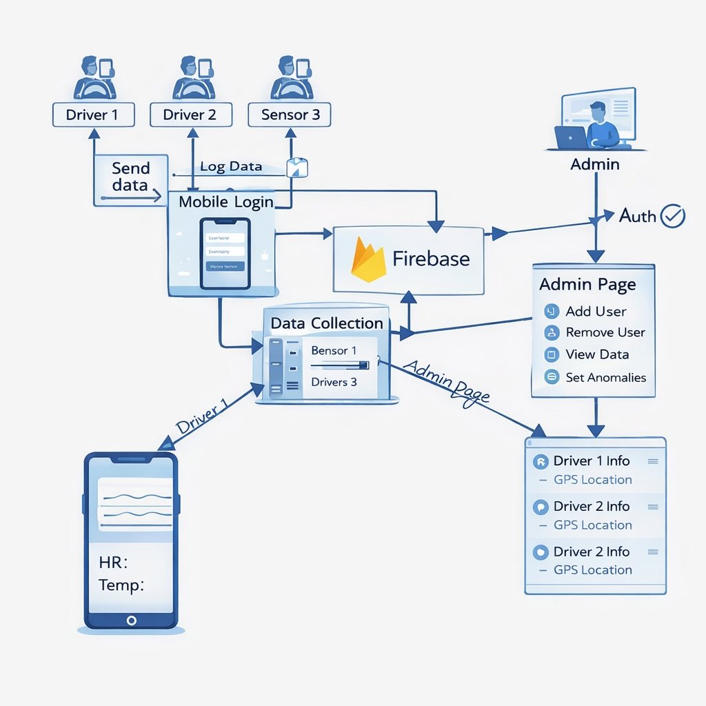

# Smart Steering Wheel: IoMT-Based Non-Invasive Driver Health Monitoring

A mobile application for real-time driver health monitoring built on the Internet of Medical Things (IoMT) architecture. This project implements a non-invasive, steering-integrated approach to collect and visualize physiological data to support road safety and driver wellness.

---

## Research Background

Driver fatigue and stress are leading contributors to road accidents worldwide. Traditional health monitoring systems often require wearable devices or intrusive sensors, which can distract drivers or discourage adoption. This application draws on research in smart steering wheel design and IoMT to deliver continuous, non-invasive monitoring through sensors embedded in the steering assembly.

The system architecture emphasizes with:

- Non-invasive physiological sensing
- Real-time data aggregation and cloud sync
- Role-based access for fleet administrators and drivers
- Isolation of driver data to preserve privacy

---

## System Overview


The application consists of three main components:

1. **Mobile application** (React Native / Expo) for admins and drivers
2. **ESP32-based hardware** with MAX30105 and temperature sensors
3. **Firebase Realtime Database** for cloud storage and synchronization

---

## Features

### Admin Dashboard

- Create and manage driver accounts with role-based access
- Assign or unassign sensor devices to drivers
- View per-driver session history (temperature, heart rate, SpO2, GSR)
- Start and stop sensor readings remotely for any driver
- Export health data as CSV (one row per session: Driver, Temperature, Heart Rate, SpO2, GSR, Timestamp, Date)
- Device manager for ESP32 sensors (test and assigned modes)

### Driver Dashboard

- Live monitoring of physiological metrics (temperature, heart rate, SpO2, GSR)
- Session history with timestamps
- GSR (Galvanic Skin Response) chart over time for stress/arousal trends
- Device status indication (ready, waiting, offline)
- Controlled reading flow with countdown before sensor activation

### Authentication and Security

- Email/password authentication via Firebase Auth
- Admin and driver roles with separate flows
- Disabled-account handling for deactivated drivers
- Data isolation: each driver sees only their own sessions

---

## Societal Impact

- **Road safety**: Early detection of fatigue or stress can prompt breaks or interventions, potentially reducing accidents.
- **Fleet management**: Organizations can monitor driver wellness at scale and enforce rest policies.
- **Privacy-aware design**: Driver data is stored per account; admins have oversight without exposing raw data across drivers.
- **Accessibility**: Non-invasive sensing avoids extra wearables and integrates into existing steering hardware.
- **Scalability**: Cloud-backed architecture supports multiple drivers and devices from a single admin interface.

---

## Architecture



---

## Project Structure

```
app/
  index.tsx          # Auth check and role-based routing
  intro.tsx          # Landing screen
  login.tsx          # Email/password login
  waiting.tsx        # Disabled account / loading state
  (admin)/           # Admin screens
    index.tsx        # Dashboard
    create-driver.tsx
    devices.tsx
    driver/[id].tsx
    export.tsx
  (driver)/          # Driver screens
    index.tsx        # Live monitor
    history.tsx
    gsr-graph.tsx
esp32/               # ESP32 firmware
  driver_health_monitor.ino
  firebase-rules.json
src/
  firebase/          # Firebase initialization
  services/          # Firebase service functions
  context/           # AuthContext, ThemeContext
assets/images/       # App icons and splash assets
```

---

## Installation Guide

### Prerequisites

Refer to `requirements.txt` for environment requirements. You need:

- Node.js 20 or later
- npm 10 or later
- Expo CLI (or use `npx expo`)
- Firebase project with Realtime Database and Authentication enabled

### 1. Clone the repository

```bash
git clone https://github.com/Prabuddha747/steering_DriverHealthCareApp.git
cd steering_DriverHealthCareApp
```

### 2. Install dependencies

```bash
npm install
```

### 3. Configure environment

Copy the example environment file and add your Firebase credentials:

```bash
cp .env.example .env
```

Edit `.env` and set:

```
EXPO_PUBLIC_FIREBASE_API_KEY=<your-api-key>
EXPO_PUBLIC_FIREBASE_AUTH_DOMAIN=<your-project>.firebaseapp.com
EXPO_PUBLIC_FIREBASE_DATABASE_URL=https://<your-project>-default-rtdb.<region>.firebasedatabase.app
EXPO_PUBLIC_FIREBASE_PROJECT_ID=<your-project-id>
EXPO_PUBLIC_FIREBASE_STORAGE_BUCKET=<your-project>.firebasestorage.app
EXPO_PUBLIC_FIREBASE_MESSAGING_SENDER_ID=<your-sender-id>
EXPO_PUBLIC_FIREBASE_APP_ID=<your-app-id>
```

### 4. Firebase setup

1. Create a Firebase project at [Firebase Console](https://console.firebase.google.com/)
2. Enable Email/Password sign-in under Authentication
3. Create a Realtime Database and deploy rules from `esp32/firebase-rules.json`
4. Add a web app to obtain the config values for `.env`

### 5. Run the application

```bash
npx expo start
```

Then:

- Open in Expo Go on a physical device (scan the QR code)
- Press `a` for Android emulator
- Press `i` for iOS simulator (macOS only)
- Press `w` for web browser

### 6. ESP32 hardware (optional)

To use physical sensors:

1. Open `esp32/driver_health_monitor.ino` in Arduino IDE
2. Set `WIFI_SSID`, `WIFI_PASSWORD`, and Firebase credentials
3. Install Firebase ESP Client and MAX30105 libraries
4. Flash the ESP32 and power it on; it will register in the app under Device Manager

### 7. Build APK for distribution

```bash
npx eas-cli login
npx eas-cli init
npx eas-cli build -p android --profile preview
```

Download the APK from the EAS build URL when the build completes.

---

## License

This project is for research and educational use. Ensure compliance with local regulations when deploying driver health monitoring systems.
